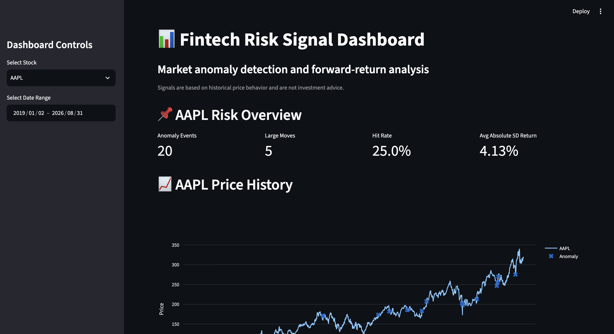
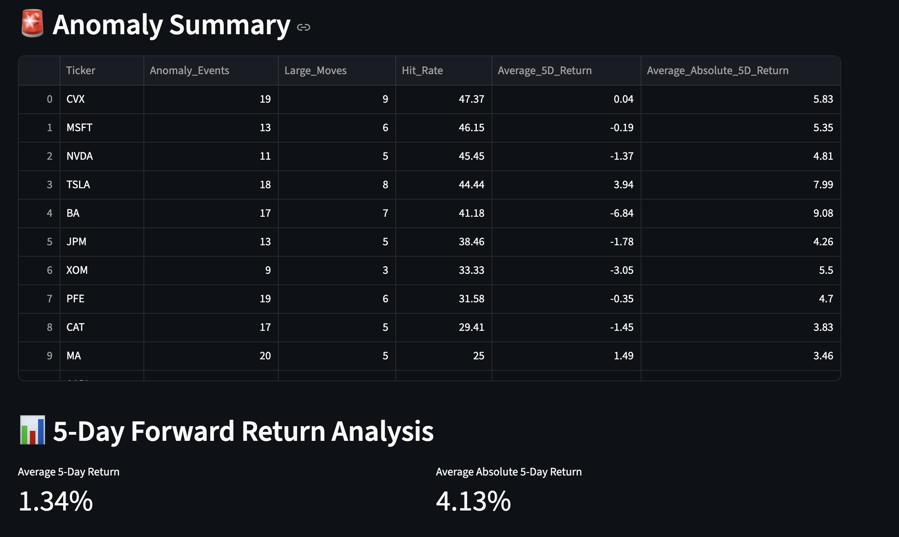
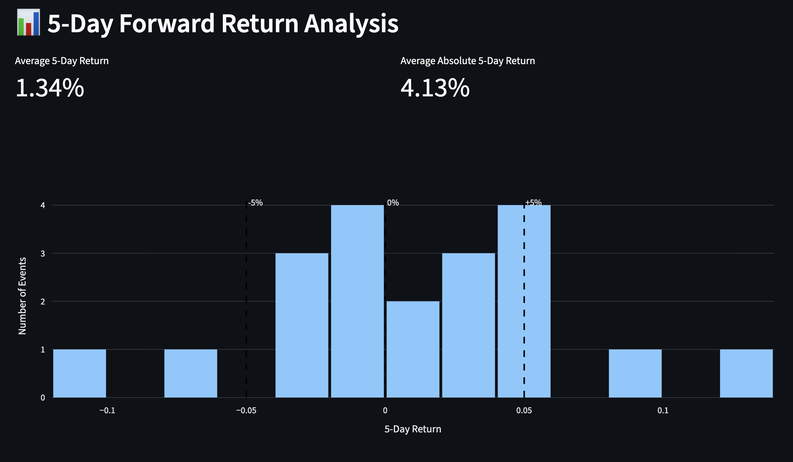
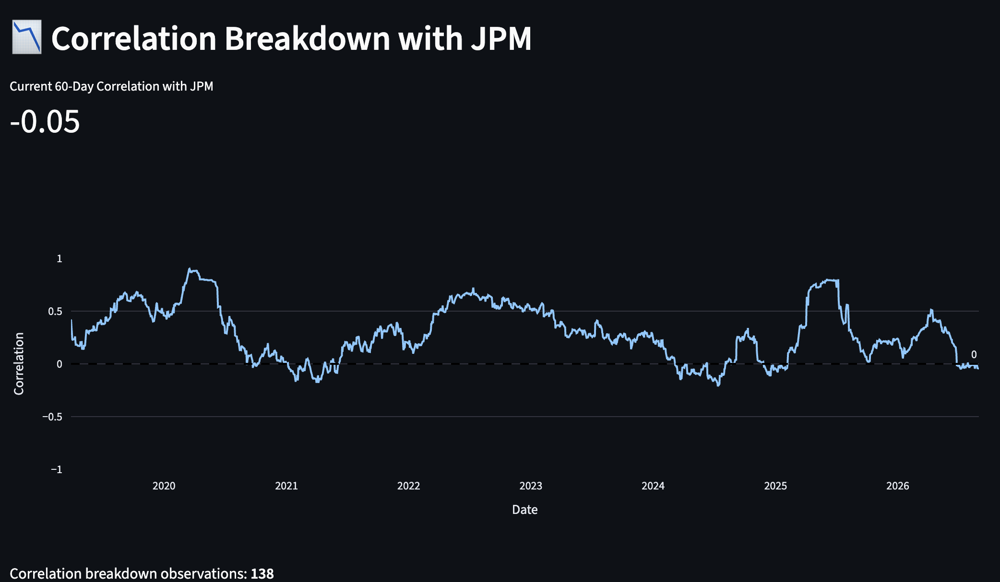
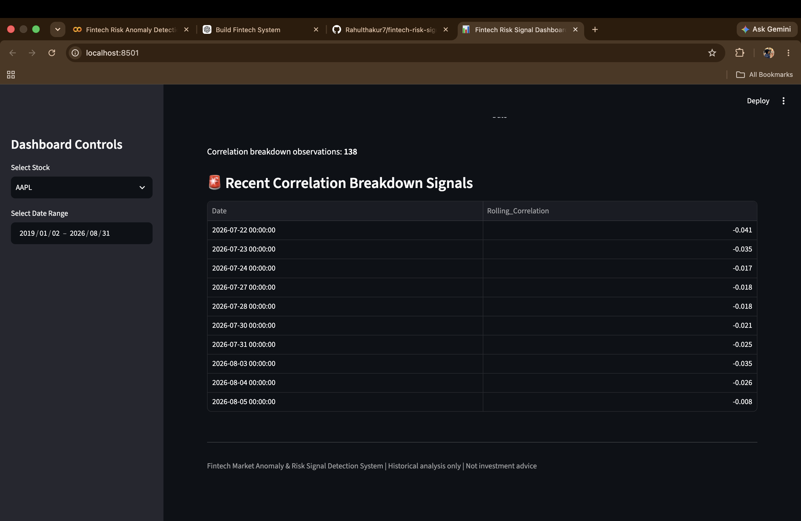
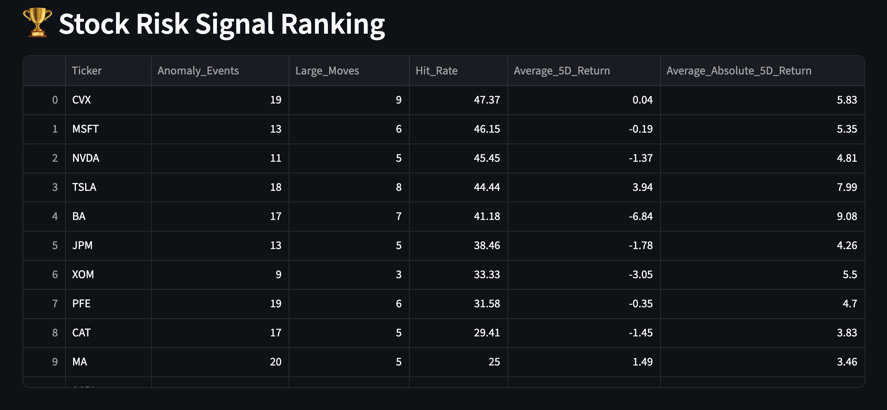

# Fintech Market Anomaly & Risk Signal Detection System

A fintech risk analytics system that detects unusual stock-market behavior, identifies correlation breakdowns, backtests risk signals, and presents the results through an interactive Streamlit dashboard.

---

## 🎯 Business Question

How can historical market data be used to identify unusual price behavior and potential early-warning risk signals across a portfolio of stocks?

This project answers that question by combining:

- Daily stock-price analysis
- Statistical anomaly detection
- Rolling correlation analysis
- MySQL-based data analysis
- 5-day signal backtesting
- Interactive Streamlit visualization
- Analyst-style risk reporting

---

## 🏗️ System Architecture

```text
Yahoo Finance / FRED
        ↓
   Data Ingestion
        ↓
      CSV Data
        ↓
      MySQL
        ↓
   SQL Analysis
        ↓
Python / Google Colab
        ↓
 ┌─────────────────────┐
 │ Z-Score Anomalies   │
 │ Correlation Breaks  │
 │ Signal Backtesting  │
 └─────────────────────┘
        ↓
 Streamlit Dashboard
        ↓
    Risk Memo
```

---

## 🔍 Key Features

### 1. Market Data Ingestion

Historical daily stock-price data is collected using Yahoo Finance.

The system monitors 16 stocks across different sectors:

- AAPL
- MSFT
- JPM
- GS
- XOM
- CVX
- PFE
- JNJ
- TSLA
- NVDA
- WMT
- KO
- BA
- CAT
- V
- MA

Macroeconomic indicators are collected from the FRED API.

---

### 2. MySQL Data Storage

The collected data is loaded into MySQL for structured storage and SQL-based analysis.

Main tables:

- `daily_prices`
- `macro_indicators`

This allows the project to combine Python-based statistical analysis with relational database analysis.

---

### 3. Statistical Anomaly Detection

The system calculates daily returns and uses rolling statistics to identify unusually large price movements.

A rolling 30-day window is used to calculate the mean and standard deviation of returns.

A stock is flagged when its return produces a large z-score relative to its recent behavior.

These anomalies represent periods of unusual market activity and are treated as potential risk signals rather than automatic buy/sell signals.

---

### 4. Correlation Breakdown Detection

The system calculates rolling correlations between stocks and JPM as a financial-sector reference stock.

A significant deterioration in the historical correlation relationship is flagged as a potential correlation-breakdown signal.

This helps identify situations where a stock may begin behaving differently from its previous relationship with the financial-sector reference.

---

### 5. 5-Day Signal Backtesting

Detected anomaly events are backtested using a 5-trading-day forward window.

For each anomaly, the system evaluates whether the stock subsequently experienced a large price movement.

The backtest provides:

- Number of anomaly events
- Number of large subsequent moves
- Hit rate
- Average 5-day return
- Average absolute 5-day return

The backtest helps evaluate whether anomaly signals contain useful early-warning information.

---

## 📊 Backtest Highlights

| Stock | Anomaly Events | Large Moves | Hit Rate | Avg. Absolute 5D Return |
|------|---------------:|-------------:|---------:|------------------------:|
| CVX  | 19 | 9 | 47.37% | 5.83% |
| MSFT | 13 | 6 | 46.15% | 5.35% |
| NVDA | 11 | 5 | 45.45% | 4.81% |
| TSLA | 18 | 8 | 44.44% | 7.99% |
| BA   | 17 | 7 | 41.18% | 9.08% |
| JPM  | 13 | 5 | 38.46% | 4.26% |
| XOM  | 9 | 3 | 33.33% | 5.50% |
| PFE  | 19 | 6 | 31.58% | 4.70% |
| CAT  | 17 | 5 | 29.41% | 3.83% |
| MA   | 20 | 5 | 25.00% | 3.46% |
| AAPL | 20 | 5 | 25.00% | 4.13% |
| GS   | 15 | 3 | 20.00% | 4.82% |
| WMT  | 25 | 5 | 20.00% | 3.15% |
| KO   | 22 | 2 | 9.09% | 2.52% |
| V    | 18 | 1 | 5.56% | 2.43% |
| JNJ  | 19 | 1 | 5.26% | 2.23% |

### Key Observations

- **CVX** recorded the highest anomaly hit rate at approximately **47.37%**.
- **MSFT** recorded a **46.15%** hit rate.
- **NVDA** recorded a **45.45%** hit rate.
- **TSLA** recorded a **44.44%** hit rate.
- **BA** recorded a **41.18%** hit rate.
- **BA** showed the largest average absolute 5-day return at approximately **9.08%**.
- **TSLA** also showed relatively large post-anomaly movements, with an average absolute 5-day return of approximately **7.99%**.

These results should be interpreted as historical signal analysis rather than evidence of guaranteed future performance.

---

## 📈 Streamlit Risk Dashboard

The project includes an interactive Streamlit dashboard designed to provide a consolidated view of market risk signals and historical stock behavior.

The dashboard includes:

- **Portfolio-level KPI cards** showing key risk statistics
- **Interactive price history** for individual stocks
- **Anomaly event detection** based on unusual return behavior
- **5-day forward-return analysis** to evaluate what happened after detected anomalies
- **Stock risk-signal ranking** to compare stocks based on anomaly and backtest activity
- **Large-move analysis** to highlight significant post-anomaly price movements
- **Rolling correlation analysis** using JPM as the financial-sector reference
- **Recent correlation-breakdown signals** to identify stocks whose historical relationships with JPM have weakened

### Dashboard Overview



### Price History & Anomaly Detection



### 5-Day Forward Return Analysis



### Correlation Breakdown



### Recent Correlation Breakdown Signals



### Stock Risk Signal Ranking



---

## 📝 Risk Memo

The project also produces an analyst-style weekly risk memo summarizing:

- Key risk signals
- Stocks with elevated anomaly activity
- Correlation breakdowns
- Stocks to watch
- Backtest observations
- Limitations of the analysis

The memo is designed to communicate the analytical findings in a concise format suitable for a risk analyst or hiring manager.

See:

`risk_memo.md`

---

## 🛠️ Technology Stack

| Technology | Purpose |
|---|---|
| Python | Data processing and statistical analysis |
| Pandas | Data manipulation |
| NumPy | Numerical calculations |
| yfinance | Historical stock-price data |
| FRED API | Macroeconomic data |
| MySQL | Data storage and SQL analysis |
| SQL | Rolling and ranking analysis |
| Scikit-learn | Statistical / machine-learning utilities |
| Statsmodels | Statistical analysis |
| ARCH | Optional volatility modeling |
| Matplotlib | Data visualization |
| Seaborn | Statistical visualization |
| Plotly | Interactive visualization |
| Streamlit | Dashboard development |
| Google Colab | Anomaly detection and backtesting |
| Git / GitHub | Version control and portfolio presentation |

---

## 📁 Project Structure

```text
fintech-risk-signals/
│
├── data/
│   ├── raw_prices.csv
│   ├── raw_macro.csv
│   ├── anomaly_backtest_results.csv
│   └── anomaly_stock_summary.csv
│
├── screenshots/
│   ├── dashboard-overview.png
│   ├── price-history.png
│   ├── 5-day-forward-return-analysis.png
│   ├── correlation-breakdown.png
│   ├── recent-correlation-breakdown-signals.png
│   └── stock-risk-signal-ranking.png
│
├── app.py
├── ingest.py
├── macro.py
├── load_data.py
├── risk_memo.md
├── README.md
├── .gitignore
└── .env
```

---

## 🔄 Data Flow

```text
Yahoo Finance
      ↓
ingest.py
      ↓
raw_prices.csv
      ↓
load_data.py
      ↓
MySQL
      ↓
SQL Analysis


FRED API
      ↓
macro.py
      ↓
raw_macro.csv
      ↓
load_data.py
      ↓
MySQL


Historical Prices
      ↓
Google Colab
      ↓
Anomaly Detection
      ↓
Correlation Analysis
      ↓
5-Day Backtesting
      ↓
CSV Results
      ↓
Streamlit Dashboard
      ↓
Risk Memo
```

---

## ⚠️ Limitations

- The analysis is based on historical market data.
- A detected anomaly does not necessarily indicate a negative event.
- The backtest measures whether an anomaly was followed by a large 5-day price movement; it does not establish causation.
- Hit rates vary substantially across stocks.
- Historical signal performance does not guarantee future performance.
- Correlation relationships can change over time.
- The analysis does not incorporate company-specific news, earnings announcements, or other fundamental information.
- The system should not be used as a standalone investment decision tool.

**Not investment advice.**

---

## 🚀 Future Improvements

With additional time and data, the system could be extended with:

- Real-time market data
- Additional macroeconomic indicators
- Company earnings and fundamental data
- News and sentiment analysis
- More advanced volatility models
- Portfolio-level risk scoring
- Machine-learning-based anomaly detection
- Automated daily risk alerts
- Longer and more robust out-of-sample backtesting
- Cloud deployment and scheduled data pipelines

---

## 🎯 Project Objective

The goal of this project is to demonstrate how market data, statistical analysis, SQL, Python, and visualization can be combined into a practical fintech risk-monitoring workflow.

The system is designed as an analytical early-warning framework rather than a trading strategy.